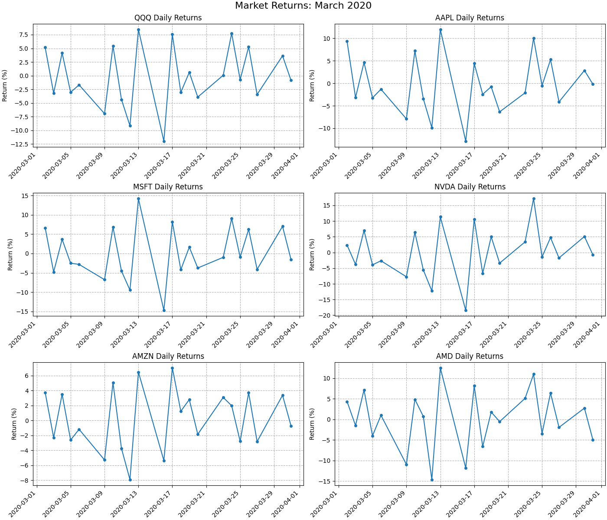
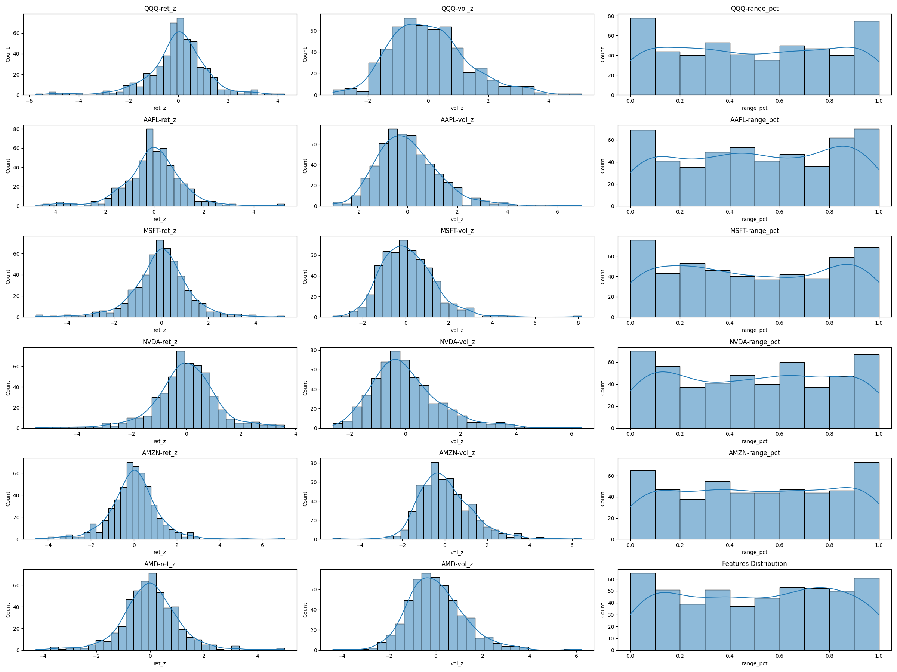

# Stock Market Anomaly Detection
> **Capstone Project**: Automated Financial Anomaly Detection System

## 1. Research Overview
**Objective**: To build an automated, unsupervised machine learning system capable of detecting financial market anomalies—such as flash crashes, liquidity shocks, and extreme volatility events—without relying on labeled historical data.

The project focuses on a "leakage-free" approach, ensuring that all detection features are computed using only past data (rolling windows) to simulate a real-world trading environment. The analysis covers high-profile tech tickers (**QQQ, AAPL, MSFT, NVDA, AMZN, AMD**) during the volatile period from **Jan 2018 to Apr 2020**.

*Figure 1: Market returns context during the analysis period, highlighting the extreme volatility in early 2020.*

---

## 2. Feature Engineering
The core of this project lies in robust feature engineering that captures market stress signals independent of price direction. 

### Core Features
| Feature | Name | Definition & Rationale |
| :--- | :--- | :--- |
| **`ret_z`** | Returns Z-Score | Measures the deviation of today's return against the volatility of the trailing **63 days**. Identifying outliers relative to recent history. |
| **`vol_z`** | Volume Z-Score | Measures if trading volume is unusually high, using a **21-day rolling window**. Log-transformed to handle skewness. |
| **`range_pct`** | Range Percentile | Ranks today's intraday volatility (High - Low) against the distribution of the last **63 days**. |
| **`severity`** | Severity Index | A composite score (0-100) averaging the percentiles of return, volume, and range. Acts as a "stress meter". |

*Figure 2: Distribution of engineered features, showing the statistical properties used for anomaly detection.*

---

## 3. Methodology & Models
We implemented and compared three distinct detection methodologies, ranging from simple heuristics to advanced density-based clustering.

### A. Rule-Based Detection (Baseline)
This method utilizes the `severity` index as a hard threshold filter.
- **Mild Stress**: Severity > 80
- **Extreme Anomaly**: Severity > 95

**Findings**: Effective at capturing obvious crashes but lacks nuance for structural changes or liquidity events without price drops.

*Figure 3: Anomalies detected using simple severity thresholds.*

### B. Unsupervised Learning: K-Means Clustering
**Hypothesis**: Market data points form clusters representing different "regimes" (e.g., Calm, Bullish, Volatile). Anomalies are points that are structurally distant from these standard regime centroids.

- **Configuration**: `K=3` clusters (Calm, Moderate, Volatile) selected via Elbow Method.
- **Anomaly Definition**: Points where the distance to the nearest cluster center is in the **95th percentile**.

*Figure 4: Elbow Method and Silhouette Score analysis used to determine optimal K=3.*

*Figure 5: Stability of K-Means clusters over time.*

### C. Density-Based: DBSCAN (Walk-Forward)
**Hypothesis**: Anomalies occur in low-density regions of the feature space. Unlike K-Means, DBSCAN does not force every point into a cluster; it explicitly labels outliers as "Noise" (-1).

- **Training**: Walk-Forward validation (retrained monthly) to prevent look-ahead bias and adapt to changing market conditions.
- **Parameters**: `eps=0.6`, `min_samples=20` (Tuned via k-Distance Graph).

*Figure 6: k-Distance graph used to identify the optimal epsilon (`eps`) parameter.*

*Figure 7: Visualization of DBSCAN clusters and noise points (anomalies).*

---

## 4. Comparative Analysis & Results

The project successfully identified major market stress events, particularly during the COVID-19 crash of March 2020.

### K-Means vs. Rule-Based
K-Means proved more adaptive than simple rules. While rule-based methods only flag "severity," K-Means could identify days that were anomalous due to unusual combinations of features (e.g., high volume but low price movement) that a linear severity score might miss.

*Figure 8: Comparison of anomalies detected by Rule-Based thresholds vs. K-Means.*

### K-Means vs. DBSCAN
DBSCAN offered the most "pure" anomaly detection. By designating points as noise, it filtered out high-variance days that were still part of a "volatile regime" (captured by K-Means) and focused only on truly unique market events.
- **DBSCAN Flag Rate**: ~5.69% of trading days.

*Figure 9: Detailed comparison of K-Means vs. DBSCAN behavior on QQQ.*

## 5. Usage Instructions
To replicate this analysis:

1.  **Dependencies**: Ensure you have `pandas`, `numpy`, `matplotlib`, `seaborn`, and `scikit-learn` installed.
2.  **Dataset**: The notebook downloads data using `kagglehub` (`jacksoncrow/stock-market-dataset`).
3.  **Run**: Execute `notebooks/StockAnomalyDetection.ipynb` sequentially.
